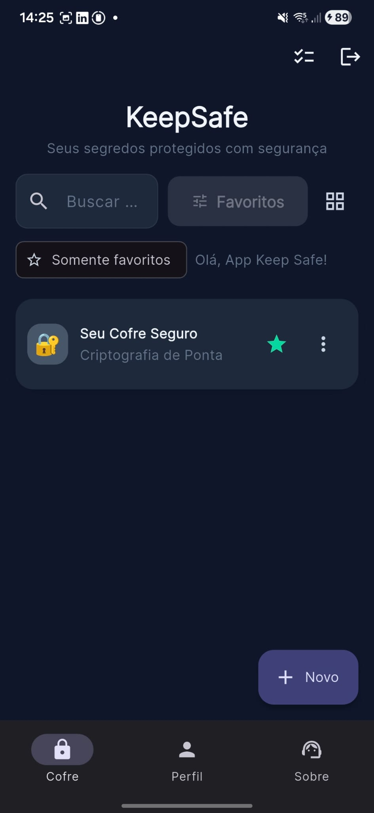
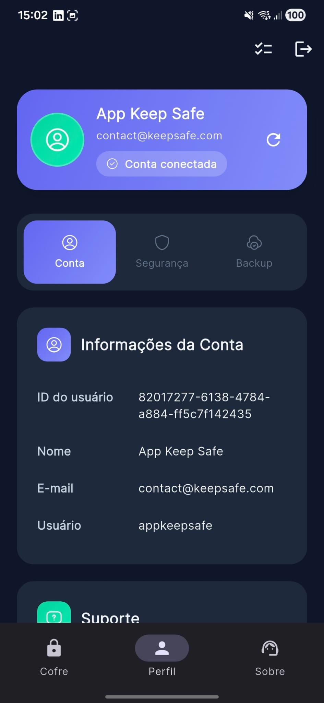
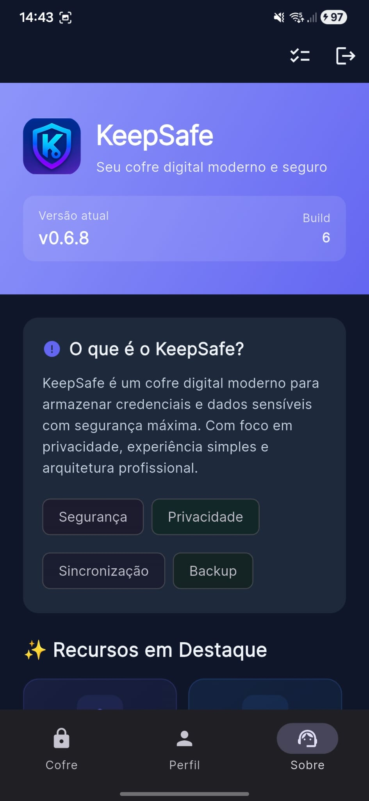

# 🔐 KeepSafe – Secure Credential Manager

Production-ready application designed to securely store and manage sensitive data such as passwords, credentials, and confidential information.

Built with a strong focus on **security, performance, and user experience**.

---

## 🧠 Overview

KeepSafe is a cross-platform application that allows users to safely manage sensitive information using modern encryption techniques.

This project was developed as a **real-world production application**, demonstrating:

- Full-stack architecture design
- Secure data handling
- Encryption best practices
- Scalable system design

---

## 🚀 Key Features

- 🔐 Encrypted credential storage
- 🔑 Secure authentication system
- ☁️ Cloud synchronization
- 💾 Local encrypted backups
- ⚡ Fast and responsive UI
- 🧠 User-friendly experience

---

## 📱 App Preview

  

<b>🏠 Home Dashboard</b>

  

<b>🔍 Perfil Management</b>

  

<b>📊 About</b>

---

## 🏗️ Architecture

The system follows a full-stack architecture:

- **Frontend:** Flutter (Android & Windows)
- **Backend:** PostgreSQL
- **Security Layer:** Encryption + Authentication

---

## 🔐 Security

Security is a core pillar of this application.

Implemented techniques include:

- 🔑 PBKDF2 (password hashing)
- 🔒 AES-GCM (data encryption)
- 🔐 bcrypt (authentication security)
- 🌐 TLS (secure communication)

👉 Sensitive implementation details are intentionally not exposed.

---

## 🧪 Technical Highlights

- Designed from scratch as a production system
- Focus on scalability and performance
- Secure local and cloud data handling
- Clean architecture principles applied

---

## 🗺️ Roadmap

- [x] Core system implementation
- [x] Encryption and authentication
- [x] Backup system
- [x] Initial deployment
- [ ] Advanced sync improvements
- [ ] Multi-device optimization
- [ ] Enhanced UX features

---

## 🚧 Status

✅ Production-ready core  
🚧 Continuous improvements in progress  

---

## 📌 Why This Project

This project demonstrates the ability to:

- Build secure applications from scratch
- Design real-world systems
- Apply modern security practices
- Deliver production-ready software

---

## 👨‍💻 Author

Developed by **Diony Costa**

- LinkedIn: https://www.linkedin.com/in/diony-silva-costa-77b9a3225
- Email: dev.diony.costa@gmail.com

---

## ⚠️ Disclaimer

This repository intentionally omits:

- Full backend logic
- Sensitive security implementations
- Production infrastructure details

This ensures system integrity while maintaining transparency.
